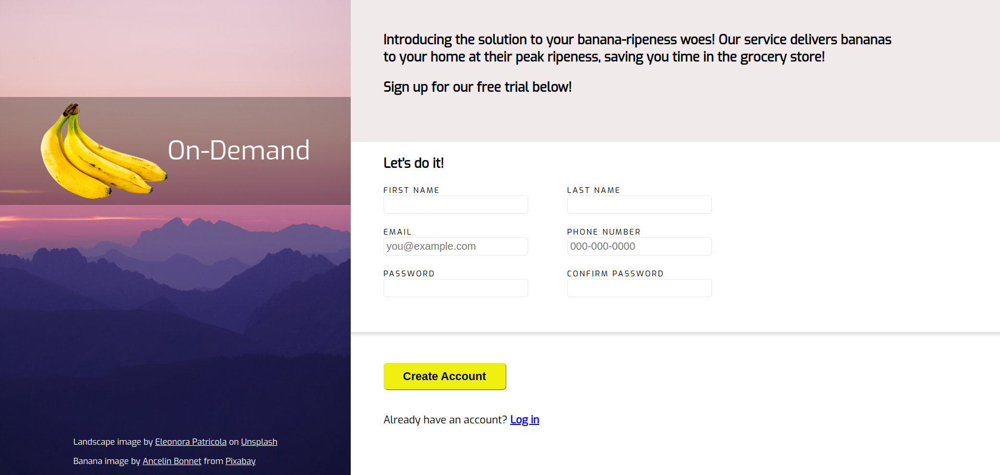

# Sign Up Form Project

## A practical demonstration of HTML forms and CSS styling

This project makes use of HTML forms and CSS to create a basic sign up form. I also wrote some JavaScript to implement 
a password confirmation feature. 

This project still has some issues with visual overlap when the window is resized. I may come back and address these issues in the future, although for now
it is not a priority.

### Credits

Landscape image by <a href="https://unsplash.com/@ele1010?utm_source=unsplash&utm_medium=referral&utm_content=creditCopyText">Eleonora Patricola</a> on <a href="https://unsplash.com/photos/a-view-of-a-mountain-range-at-sunset-akYViZ6nmIA?utm_source=unsplash&utm_medium=referral&utm_content=creditCopyText">Unsplash</a>

https://unsplash.com/photos/a-view-of-a-mountain-range-at-sunset-akYViZ6nmIA 

Banana image by <a href="https://pixabay.com/users/ancelin-1987740/?utm_source=link-attribution&utm_medium=referral&utm_campaign=image&utm_content=1218133">Ancelin Bonnet</a> from <a href="https://pixabay.com//?utm_source=link-attribution&utm_medium=referral&utm_campaign=image&utm_content=1218133">Pixabay</a>

https://pixabay.com/photos/fruit-bananas-png-yellow-cut-out-1218133/